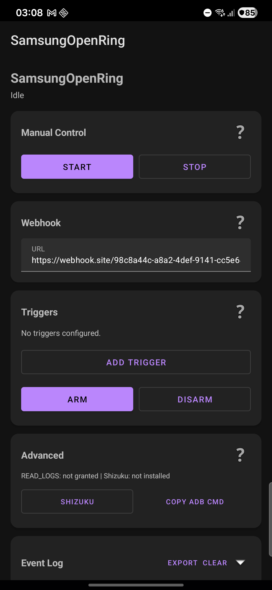

# SamsungOpenRing

> **This is an independent hobby project by a tinkerer who wanted more from his Galaxy Ring.** Samsung's double-pinch gesture is limited to two hardcoded actions (camera shutter and alarm dismiss). This project unlocks that gesture for whatever you want — open your parking gate, control your smart home, trigger automations, or anything else a webhook can reach. It is built for personal use and educational exploration of BLE protocols. Not affiliated with Samsung. No warranty. Use at your own risk.

Open-source SDK and companion app for the Samsung Galaxy Ring. Enables custom gesture-triggered actions without Samsung's official SDK.

<p align="center">
  
  &nbsp;&nbsp;
  
</p>

## What it does

SamsungOpenRing connects to your Galaxy Ring over BLE as a second GATT client (alongside Samsung's official app) and lets you:

- **Detect double-pinch gestures** independently of Samsung's camera/alarm integration
- **Fire webhooks** on each gesture (control smart home, open gates, trigger automations)
- **Configure triggers** that automatically enable/disable gesture detection based on context

## How it works

The Samsung Galaxy Ring's BLE protocol was reverse-engineered from the companion app and live traffic captures. SamsungOpenRing sends the same `ENABLE_GESTURE` command that Samsung's camera app sends, allowing the ring to report pinch gestures directly to our app.

**No root required.** No modifications to Samsung's app. No ADB setup for basic functionality.

See [RFC-SGR-001](docs/RFC-SGR-001-Samsung-Galaxy-Ring-Protocol.md) for the full protocol specification.

## Features

### Core Library

```kotlin
// 3 lines to detect gestures
OpenRing.connect(context) { event ->
    Log.d("MyApp", "Pinch detected: ${event.gestureId}")
}
OpenRing.enableGestures { event ->
    // Handle gesture
}
```

### Companion App

- **Manual control** -- start/stop gesture monitoring with a button
- **Webhook integration** -- HTTP POST to any URL on each gesture
- **7 trigger types:**
  - Bluetooth device connection (e.g., car stereo)
  - Android Auto
  - WiFi network (by SSID)
  - Time schedule (start/end time + days of week)
  - Location geofence (lat/lng/radius)
  - Phone charging
  - App in foreground
- **Event log** with full BLE protocol trace, exportable for debugging
- **Auto-reconnect** with exponential backoff
- **Survives reboots** -- triggers re-arm automatically

## Installation

### From APK

1. Download the latest APK from [Releases](../../releases)
2. Install on your Samsung Galaxy phone (Android 12+)
3. Open the app, grant Bluetooth permission
4. Configure your webhook URL and triggers

### From Source

```bash
git clone https://github.com/TheVellichor/SamsungOpenRing.git
cd SamsungOpenRing
./gradlew assembleDebug
adb install app/build/outputs/apk/debug/app-debug.apk
```

Requires:
- Android SDK (compileSdk 34)
- JDK 17
- Galaxy Ring paired with your phone via Samsung's official app

## Requirements

- Samsung Galaxy phone with Android 12+ (API 31+)
- Samsung Galaxy Ring (SM-Q500/Q508/Q509) paired via Galaxy Wearable app
- Samsung's official Ring Manager app must remain installed (handles BLE bonding)

## Battery Impact

The ring's double-pinch detector keeps its motion sensor (IMU) in a high-power,
always-sampling mode. Samsung's own app only switches this on momentarily (camera
open, alarm ringing) precisely because leaving it on is the single biggest drain
on the ring — enough to cut a ~1-week battery down to ~1 day.

SamsungOpenRing therefore takes two precautions:

- **It does not fight Samsung's power management.** When Samsung's app duty-cycles
  gesture detection off, we respect that instead of immediately re-enabling it.
  (Older builds re-enabled on every external disable, which pinned the IMU on
  continuously — the classic "ring dies in a day" bug.)
- **Gestures stay on only for the genuine trigger window.** Detection is enabled
  when the first trigger activates and disabled when the last trigger deactivates
  (e.g. on for your drive while connected to the car, off when you disconnect).
- **An absolute safety cap bounds a stuck/forgotten window.** A hard ceiling
  (default 8 h, `DEFAULT_MAX_SESSION_MS` in `GestureService`) — measured from when
  gestures were first enabled and persisted so it survives reconnects and restarts
  — disables gestures and stops the service if a window never ends (a forgotten
  manual session, or a trigger that never fires its OFF edge). It is NOT reset by
  pinches or repeated trigger activations, so trigger churn can't extend it.
- **Lower-power BLE.** Our second connection requests
  `CONNECTION_PRIORITY_LOW_POWER` to relax the connection interval.

Net effect: the feature works across a normal window, while a stuck window can't
silently pin the ring's sensor for many hours. The second BLE connection itself is
cheap; it's the IMU, not the radio, that drains the ring.

> **Important:** per Samsung's own rating, gesture use is cheap, and the common
> "1-week → 1-day" Galaxy Ring drain is usually a hardware/firmware defect (a stuck
> sensor that Samsung replaces under warranty) or the ring being left out of its
> charging case — not this app. The debug build's **Claude Bridge** logs the ring's
> battery %/hour (`RING BATTERY` lines in the event log) so you can run a 24 h A/B
> (app armed vs fully stopped) and find out for sure.

## Architecture

```
SamsungOpenRing/
  core/     -- BLE connection, protocol, gesture detection (library)
  app/      -- Companion app with triggers, webhook, UI
```

### Core Library (`:core`)

- `OpenRing` -- public API entry point
- `RingConnection` -- BLE GATT client with auto-reconnect
- `RingProtocol` -- Samsung SAP message encoding/decoding
- `RingScanner` -- finds bonded Galaxy Ring from paired devices

### Companion App (`:app`)

- `GestureService` -- foreground service for persistent monitoring
- `WebhookSender` -- fires HTTP POST on gesture events
- `EventLog` -- persistent, rotatable event log
- `triggers/` -- pluggable trigger system

## Protocol

The Galaxy Ring uses a proprietary BLE protocol built on Samsung's Accessory Protocol (SAP). Key details:

- **GATT Data Service:** `00001b1b-0000-1000-8000-00805f9b34fb`
- **Gesture Channel:** 22 (0x16)
- **Enable gestures:** Write `0x16 0x16 0x00` to TX characteristic
- **Disable gestures:** Write `0x16 0x16 0x01` to TX characteristic
- **Gesture event:** Notification `0x16 0x16 0x02 [counter] 0x00 0x00 0x00`

Full protocol specification: [RFC-SGR-001](docs/RFC-SGR-001-Samsung-Galaxy-Ring-Protocol.md)

## Disclaimer

This project is not affiliated with, endorsed by, or sponsored by Samsung Electronics. "Samsung" and "Galaxy Ring" are trademarks of Samsung Electronics Co., Ltd.

This software interacts with the Galaxy Ring using the same BLE commands that Samsung's official companion app uses. However, **use at your own risk**. The authors take no responsibility for any impact on your ring's functionality, battery life, or warranty.

## License

MIT -- see [LICENSE](LICENSE)
